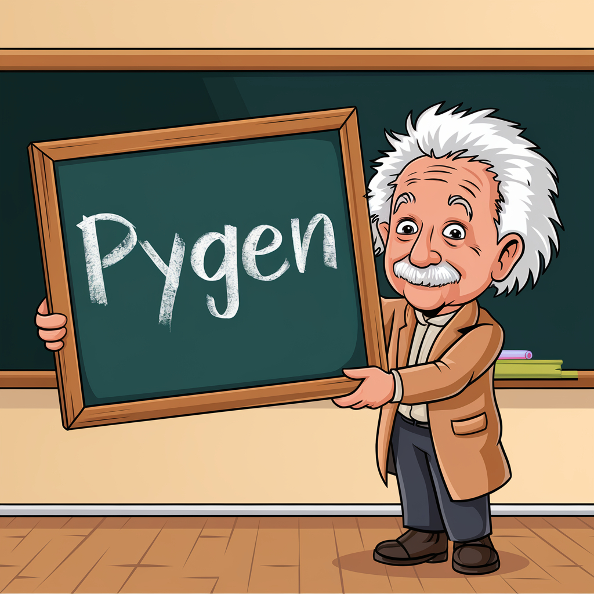

<h1 align="center">
  <a href="https://github.com/GitsSaikat/PyGen">
    </a><br>
  <b>PyGen: Turning Your Ideas into Python Package 🚀</b><br>
  <b>Empowering the World with Automated Python Package Creation 🐍</b><br>
</h1>

<p align="center">
  📚 <a href="https://github.com/GitsSaikat/PyGen">[GitHub Repository]</a> |
  📝 <a href="https://arxiv.org/abs/2411.08932">[Paper]</a>
</p>

 **Hello World, Welcome to PyGen!**
 

Imagine if turning your wildest ideas into software was as easy as asking for it—that's what PyGen is all about! Whether you're a researcher, a tech enthusiast, or someone with a creative spark, PyGen helps turn abstract thoughts into real, functioning Python tools. With the power of advanced language models, PyGen makes coding simpler, faster, and more fun.

PyGen is like having a tech-savvy assistant who builds software for you. From an idea to a full-blown Python package—complete with testing and documentation—PyGen does the heavy lifting. We've even built examples like AutoML (automated machine learning), AutoVision (computer vision), AutoSpeech, and tools for Quantum Error Correction to show what's possible.

PyGen is about making technology accessible to everyone, sharing knowledge, and bringing your ideas to life. This is just the beginning, and we can't wait to see how you use PyGen to shape the future!

> **Note:** Please use PyGen responsibly and make sure to test the generated code for safety and correctness.

<p align="center">
  <a href="https://github.com/GitsSaikat/PyGen/Logo.jpg">
    
  </a>
</p>

## Table of Contents

1. [Introduction](#introduction)
2. [Requirements](#requirements)
3. [Installation](#installation)
4. [Getting Started](#getting-started)
5. [Tutorial](#tutorial)
6. [Examples](#examples)
7. [Contributing](#contributing)
8. [License](#license)
9. [Citations](#citations)

## Introduction

PyGen is an automation tool that helps you transform your creative or research ideas into fully functional Python packages, reducing the amount of manual coding required.

## Requirements

- Python 3.8+
- Git
- Virtual environment tool (like `venv` or `conda`)

## Installation

Clone the repository and navigate into the directory:

```bash
git clone https://github.com/GitsSaikat/PyGen.git
cd PyGen
```

Create and activate a virtual environment:

```bash
python -m venv myenv
source myenv/bin/activate
```

Install the required dependencies:

```bash
pip install -r requirements.txt
```

## Getting Started

To start using PyGen, run the main script:

```bash
streamlit run app.py
```

## Tutorial

🎥 **Watch our YouTube Tutorial:**  
Learn how to get started with PyGen and explore its features by watching our comprehensive [YouTube tutorial](https://youtu.be/1e_sGCcaO5U?si=zes2lT95if3IA03K).

In this tutorial, you'll discover:
- How to set up PyGen on your local machine
- Step-by-step guidance on creating your first Python package with PyGen
- Tips and best practices to maximize the potential of automated package creation
- Demonstrations of advanced features and example projects

Whether you're a beginner or an experienced developer, our tutorial will help you harness the full power of PyGen to bring your ideas to life effortlessly.


## Examples

Here are some of the amazing packages created by PyGen:

- **AutoML**: Automated Machine Learning pipelines.
- **AutoVision**: Computer Vision models and solutions.
- **AutoSpeech**: Speech processing package.
- **Quantum Error Correction**: Simple Quantum Error Correction Package.

## Contributing

We welcome contributions! If you want to help us make PyGen even better, please submit a pull request or open an issue.

## License

PyGen is licensed under the MIT License. See the [LICENSE](https://github.com/GitsSaikat/PyGen/blob/main/LICENSE) file for more details.

## Citations

If you use PyGen in your research or project, please cite it as follows:

  ```bibtex
@misc{barua2024pygencollaborativehumanaiapproach,
      title={PyGen: A Collaborative Human-AI Approach to Python Package Creation}, 
      author={Saikat Barua and Mostafizur Rahman and Md Jafor Sadek and Rafiul Islam and Shehnaz Khaled and Md. Shohrab Hossain},
      year={2024},
      eprint={2411.08932},
      archivePrefix={arXiv},
      primaryClass={cs.SE},
      url={https://arxiv.org/abs/2411.08932}, 
}
 ```   

